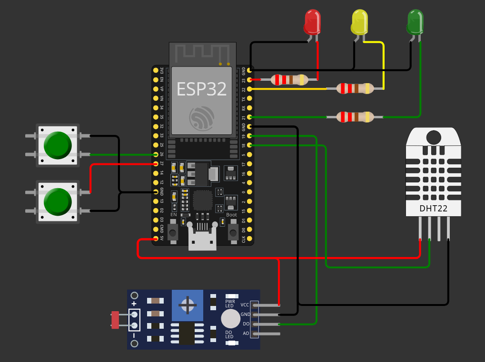

# 📊 Monitoring system using ESP32

## 📖 System Description
This project is a real-time IoT monitoring system powered by an **ESP32** microcontroller. It uses the **MQTT protocol** to transmit temperature, humidity, and light intensity data to a centralized dashboard.

The main goal is to provide an efficient, robust, and low-power solution for environmental monitoring.
##  📡 Architecture 
### 💻 Firmware 
The firmware is built on top of **FreeRTOS**, leveraging task management to implement a **Finite State Machine (FSM)**. This FSM has three distinct modes of operation:

- ⚡ **Performance (Active Mode):** In this mode, the ESP32 executes a periodic task that acquires data from the DHT11 (temperature/humidity) and LDR (light) sensors. This telemetry is serialized and published via MQTT to the broker. (Details on the MQTT topics can be found in the "MQTT Configuration" section).
- ⚙️ **Configuration:** 
- 💤 **Deep Sleep:** The system enters Deep Sleep mode to minimize power consumption. In this state, the CPU and WiFi are disabled. The device remains dormant until it is manually woken up via an external interrupt (button press), transitioning the system back to performance mode.

### 🔌 Hardware & Pinout Configuration
The system connects sensors, actuators, and controls to the ESP32 as follows:

#### 🟢 Status Indicators (Outputs)
Visual feedback for the Finite State Machine (FSM) modes.
| Component | Color | ESP32 Pin | Function |
| :--- | :--- | :---: | :--- |
| **Performance LED** | 🟢 Green | `GPIO 21` | Indicates the system is active and publishing MQTT data. |
| **Config LED** | 🟡 Yellow | `GPIO 22` | Indicates the system is in Configuration mode. |
| **Sleep LED** | 🔴 Red | `GPIO 23` | Brief indicator before entering/during Deep Sleep. |

#### 🕹️ Controls & Sensors (Inputs)
Peripherals for data acquisition and state management.

| Component | Type | ESP32 Pin | Function |
| :--- | :--- | :---: | :--- |
| **DHT11** | Sensor | `GPIO 18` | Temperature & Humidity data acquisition. |
| **LDR** | Sensor | `GPIO 19` | Light intensity detection. |
| **Mode/Wake Button** | Push Button | `GPIO 26` | **1.** Toggles between Performance/Config modes. **2.** Triggers **External Wake-up** from Deep Sleep. |
| **Sleep Button** | Push Button | `GPIO 27` | Forces the system into Deep Sleep mode immediately. |

### ☁️ MQTT Configuration

Eclipse Mosquitto is the open-source broker used for the communications. It was chosen for its lightweight architecture, making it highly suitable for IoT messaging involving low-power sensors, embedded computers, and microcontrollers like the ESP32. 

To ensure security, anonymous access is disabled, and connections are authenticated via a pre-defined username and password list.

#### 🗂️ MQTT Topic Hierarchy

The project follows a strict hierarchical topic pattern to organize data flow:
* **Patern:** `<device_type>/<device_id>/<category>/<subcategory>`

##### 📡 Telemetry (Publish)
Data sent **FROM** the ESP32 **TO** the Broker.

| Metric | Example topic | Payload Type | Description |
| :--- | :--💻- | :---: | :--- |
| **Temperature** | `ESP32/1/telemetry/temperature` | `Int` | Ambient temperature from DHT11 (°C). |
| **Humidity** | `ESP32/1/telemetry/humidicity` | `Int` | Relative humidity percentage (%). |
| **Light Level** | `ESP32/1/telemetry/light` | `bool` | LDR sensor value. |

##### ⚙️ Configuration & Commands (Subscribe)
Commands sent **FROM** the Broker **TO** the ESP32.

| Command | Topic Suffix | Payload | Action |
| :--- | :--- | :--- | :--- |
| **Force Sleep** | `.../config/sleep` | `true` | Forces the device into Deep Sleep immediately. |
| **Change Mode** | `.../config/mode` | `String` | Manually switches mode (e.g., set to `config`). |

## 🛠️ Tools & Technologies 

This project was developed using the official Espressif framework within VS Code.

### 📚 Dependencies 
- Framework ESP-IDF
- External Libraries DHT11: API for the DHT11 sensor
- External Libraris Frozen: API for serialize json to send via MQTT
- freeRTOS

<!-- FALTA APARTADO DEMOSTRACION >
