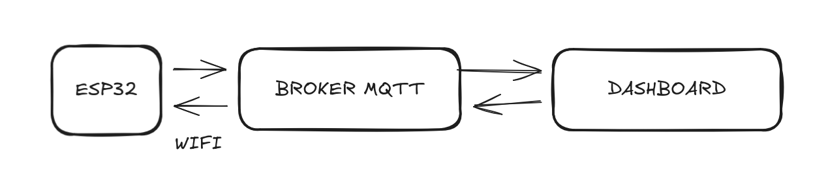

# 📊 Monitoring system using ESP32

## 📖 System Description
This project is a real-time IoT monitoring system powered by an **ESP32** microcontroller. It uses the **MQTT protocol** to transmit temperature, humidity, and light intensity data to a centralized dashboard.

The main goal is to provide an efficient, robust, and low-power solution for environmental monitoring.
##  📡 Architecture 
### 💻 Firmware 
The firmware is built on top of **FreeRTOS**, leveraging task management to implement a **Finite State Machine (FSM)**. This FSM has three distinct modes of operation:

- ⚡ **Performance (Active Mode):** In this mode, the ESP32 executes a periodic task that acquires data from the DHT11 (temperature/humidity) and LDR (light) sensors. This telemetry is serialized and published via MQTT to the broker. (Details on the MQTT topics can be found in the "MQTT Configuration" section).
- ⚙️ **Configuration:** In this mode, all system parameters can be modified and configured.
- 💤 **Sleep:** Stops sensor data collection while keeping the Wi-Fi connection alive to respond to incoming MQTT commands.

### 🔌 Hardware & Pinout Configuration
The system connects sensors, actuators, and controls to the ESP32 as follows:

#### 🟢 Status Indicators (Outputs)
Visual feedback for the Finite State Machine (FSM) modes.
| Component | Color | ESP32 Pin | Function |
| :--- | :--- | :---: | :--- |
| **Performance LED** | 🟢 Green | `GPIO 21` | Indicates the system is active and publishing MQTT data. |
| **Config LED** | 🟡 Yellow | `GPIO 22` | Indicates the system is in Configuration mode. |
| **Sleep LED** | 🔴 Red | `GPIO 23` | Brief indicator before entering/during Deep Sleep. |
| **Configuration LED** | 🔴 Red | `GPIO 25` | when Wi-Fi/MQTT setup is incomplete or pending. |
| **Connection LED** | 🟢 Green | `GPIO 17` | when Wi-Fi/MQTT setup is ready. |

#### 🕹️ Controls & Sensors (Inputs)
Peripherals for data acquisition and state management.

| Component | Type | ESP32 Pin | Function |
| :--- | :--- | :---: | :--- |
| **DHT11** | Sensor | `GPIO 18` | Temperature & Humidity data acquisition. |
| **LDR** | Sensor | `GPIO 19` | Light intensity detection. |
| **Mode/Wake Button** | Push Button | `GPIO 26` | **1.** Toggles between Performance/Config modes. **2.** Triggers **External Wake-up** from Deep Sleep. |
| **Sleep Button** | Push Button | `GPIO 27` | Forces the system into Deep Sleep mode immediately. |

### ☁️ MQTT Configuration

Eclipse Mosquitto is the open-source broker used for the communications. It was chosen for its lightweight architecture, making it highly suitable for IoT messaging involving low-power sensors, embedded computers, and microcontrollers like the ESP32. 

To ensure security, anonymous access is disabled, and connections are authenticated via a pre-defined username and password list.

#### 🗂️ MQTT Topic Hierarchy

The project follows a strict hierarchical topic pattern to organize data flow:
* **Patern:** `<device_type>/<device_id>/<category>/<subcategory>`

##### 📡 Telemetry (Publish)
Data sent **FROM** the ESP32 **TO** the Broker.

| Metric | Example topic | Payload Type | Description |
| :--- | :--- | :---: | :--- |
| **Temperature** | `ESP32/"id"/telemetry/temperature` | `Int` | Ambient temperature from DHT11 (°C). |
| **Humidity** | `ESP32/"id"/telemetry/humidity` | `Int` | Relative humidity percentage (%). |
| **Light Level** | `ESP32/"id"/telemetry/light` | `Bool` | LDR sensor value. |
| **Error** | `ESP32/"id"/error` | `json: {error:"error description"}` | Reports sensor failures o bad configurations. |

##### ⚙️ Configuration & Commands (Subscribe)
Commands sent **FROM** the Broker **TO** the ESP32.

| Command | Topic Suffix | Payload | Action |
| :--- | :--- | :--- | :--- |
| **Force Sleep** | `.../config/OFF` | `none` | Forces the device into Sleep immediately. |
| **Performance Mode** | `.../config/ON` | `none` |  Force the device into performance mode. |
| **Configuration Mode** | `.../config/CONFIG` | `none` | Force the device into configuration mode. |
| **Delay configuration** | `.../config/delay` | `json: {delay:value}` | Defines the time delay between sensor data acquisitions (unit: ms).

> **Note:** The minimum sensor reading interval is 2 seconds.

## 🛠️ Tools & Technologies 

This project was developed using the official Espressif framework within VS Code.

### 📚 Dependencies 
- Framework ESP-IDF
- External Librarie DHT11: API for the DHT11 sensor
- External Librarie Frozen: A lightweight JSON parser/generator used for serializing telemetry data to send via MQTT.
- freeRTOS

## 🚀 Demo

See the project in action:

https://github.com/user-attachments/assets/1468c1e0-405c-44dc-9d9b-48d370249971
